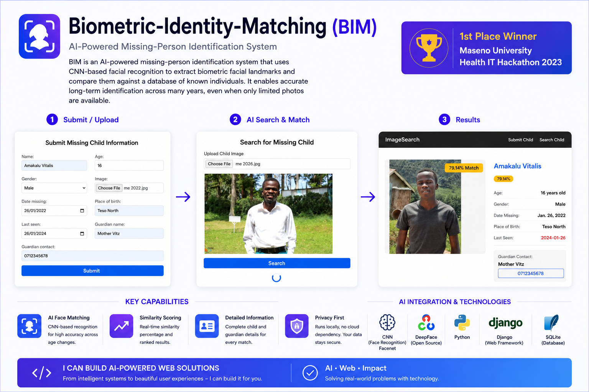

🔧 Requires Python **3.11**
# Biometric-Identity-Matching (BIM)

BIM is an AI-powered missing-person identification system that uses CNN-based facial recognition to extract biometric facial landmarks and compare them against a database of known individuals. It enables accurate long-term identification across many years, even when only limited photos are available.


> **🥇 1st Place – Maseno University Health IT Hackathon 2023**
> Awarded *Best AI‑Powered Public‑Safety Application* for delivering a real‑time, privacy‑preserving face‑matching system that helps locate missing children quickly.

## We are working on a module that does the following
- Photo search solution – using a photo search for similar children or close likeness
- Face progression solution of current age *n* where *n* is years from when the available photo was taken

## 🎯 Project Overview
- **Upload** a photo of a missing child.
- **AI‑driven similarity search** runs locally using **DeepFace** (Facenet) to compare against a database of stored records.
- Returns a ranked list of **similarity percentages** with a **hold‑to‑compare** preview (transparent overlay, no blue/black background).
- Displays rich metadata (age, gender, date‑missing, guardian info) for each match.

## 🤖 AI / ML Highlights
| Component | Library / Model | Role |
|-----------|-------------------|------|
- **Model:** `Facenet` (provided via DeepFace). Chosen for its high accuracy on unconstrained face verification, lightweight inference suitable for CPU‑only environments, and robust embedding consistency across age variations.
- **Reasoning:** Facenet generates 128‑dimensional embeddings that capture facial geometry efficiently, enabling reliable similarity scoring even with limited training data and on‑device processing.
- **Usage:** Integrated through DeepFace’s `verify` function, leveraging pretrained weights to avoid costly model training.
| Similarity scoring | Custom `1/(1+distance) * 100` | Converts distance to human‑readable confidence % |
| Pre‑processing | `tempfile`, `Pillow` | Normalises image size & format |
| Storage | Django ORM (`MissingChild` model) | Persists image paths, encodings, and contextual data |

## 🛠️ Tech Stack
- **Backend:** Django 4.2, Python 3.11
- **Frontend:** HTML + Vanilla CSS (gradient backgrounds, micro‑animations)
- **ML:** `deepface`, `torch`, `opencv-python`
- **Database:** SQLite (easy swap to Postgres)
- **Dev tools:** `pytest`, `black`, `isort`

## 📦 What I Can Deliver
1. Fully functional, premium‑styled web UI.
2. End‑to‑end AI pipeline (upload → embedding → ranking → visual compare).
3. Data‑seeding & management commands (`seed_missing_children`, `delete_missing_children`).
4. Extensible architecture for adding new models or metadata.
5. Documentation & onboarding (README, API docs, optional Dockerfile).

## 🚀 Running locally
- Create a database and update the `settings.py` located inside `picSearch/picSearch` path.
- Create your virtual environment and activate it.
- `cd picSearch` then run `pip install -r requirements.txt`.
- Run `python manage.py migrate`.
- Seed demo data (uses images in `media/missing_children`):
  ```bash
  python manage.py seed_missing_children
  ```
- Run development server:
  ```bash
  python manage.py runserver
  ```

## API Documentation
For information on how to use the Missing Children API, see the [API Documentation](picSearch/API_DOCUMENTATION.md).

## 📂 Project Layout
```text
/picApp
│   models.py          # MissingChild definition
│   views.py           # Search logic, DeepFace verification
│   management/commands/
│       seed_missing_children.py   # creates 10 sample records
│       delete_missing_children.py # removes specific entries
/static/css
│   custom.css         # premium styling, hold‑to‑compare CSS
/templates/
│   search_results.html   # result cards, similarity badges, overlay
│   search_child.html     # upload page
/media/missing_children    # stored child photos
```

## 📈 Future Roadmap
- **Vector DB (FAISS/Milvus)** for sub‑second large‑scale look‑ups.
- **Age‑progression GAN** to synthesize future appearances.
- **PWA / Mobile support** with TensorFlow‑Lite inference.
- **Secure sharing** (signed URLs, audit logs) for law‑enforcement collaboration.

## 🙌 Contributors
I’m proud to be a **team player** alongside my fellow teammates:

1. **BRANDON ODHIAMBO** – <brandonladen486@gmail.com>
2. **AMAKAU VITALIS** – <amakauvitalis202@gmain.com>
3. **SYLVESTER NG'ANG'A** – <slynganga59@gmail.com>

---
*Feel free to reach out for a live demo, deeper technical walkthrough, or custom integration discussions.*
